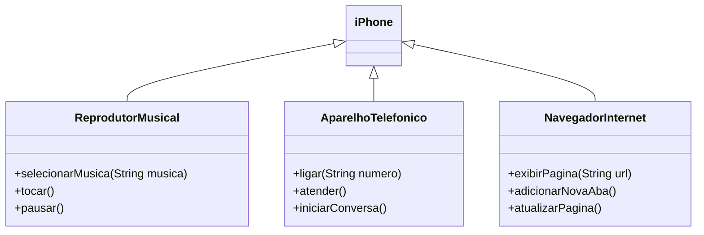

# Diagramação UML para as funcionalidade do iPhone

```mermaid
classDiagram
    iPhone <|-- ReprodutorMusical
    iPhone <|-- AparelhoTelefonico
    iPhone <|-- NavegadorInternet

    class ReprodutorMusical{
      +selecionarMusica(String musica)
      +tocar()
      +pausar()
    }
    class AparelhoTelefonico{
      +ligar(String numero)
      +atender()
      +iniciarConversa()
    }
    class NavegadorInternet{
      +exibirPagina(String url)
      +adicionarNovaAba()
      +atualizarPagina()
    }
```
